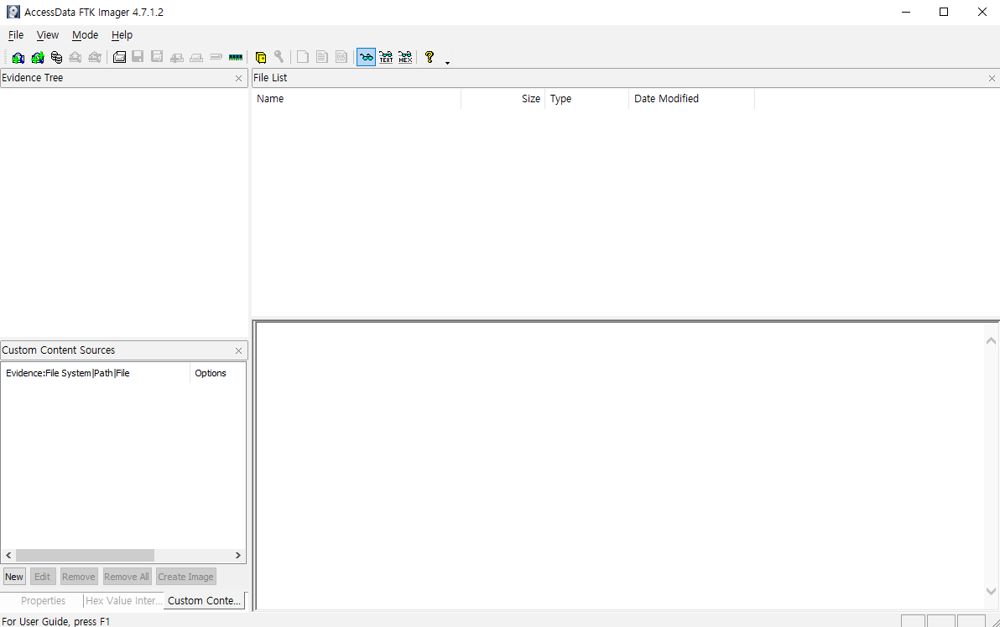
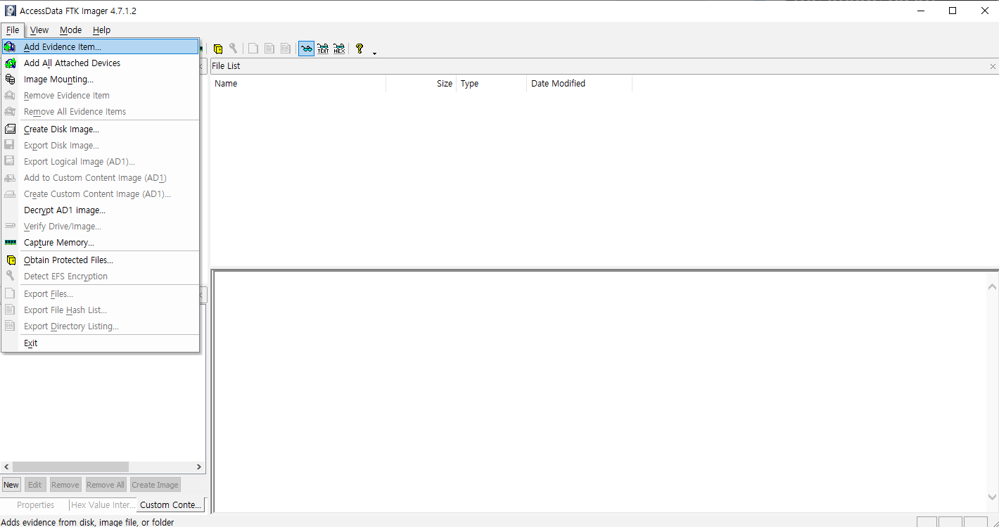
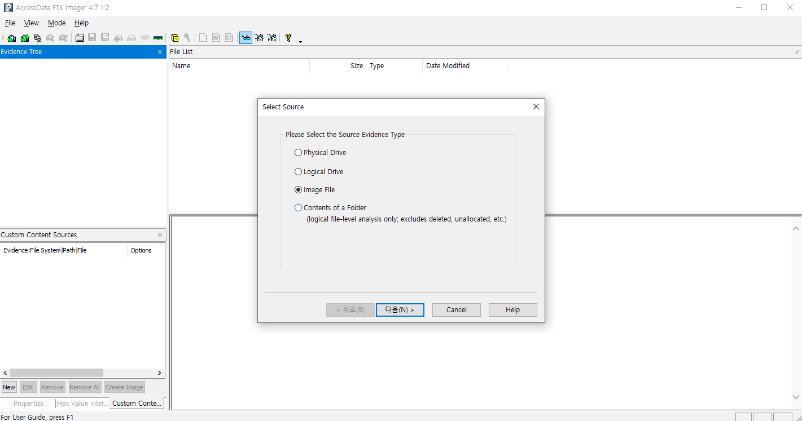
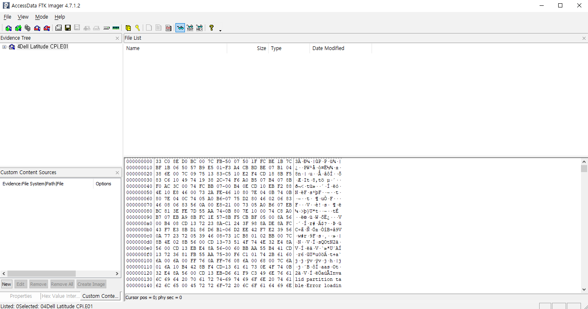
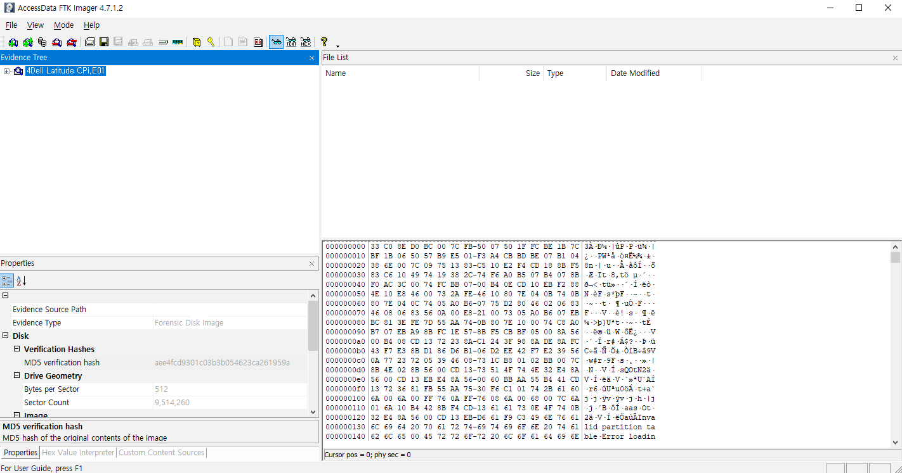
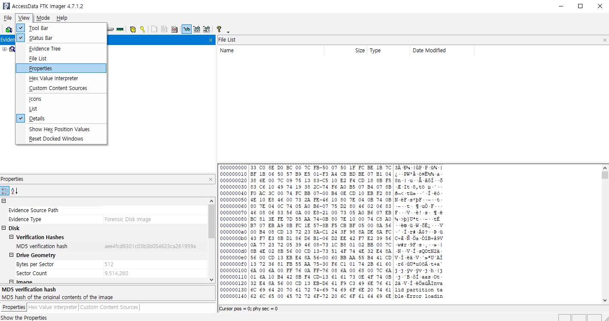
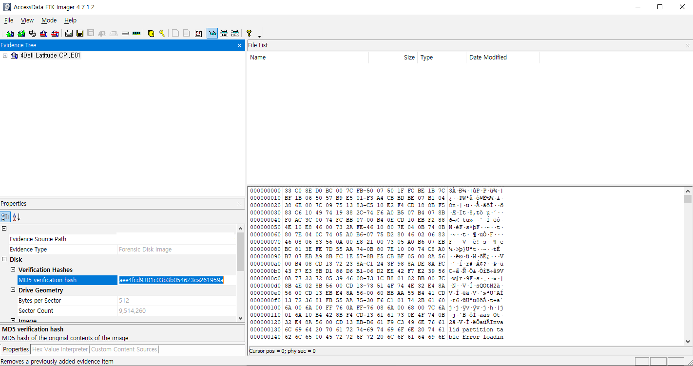
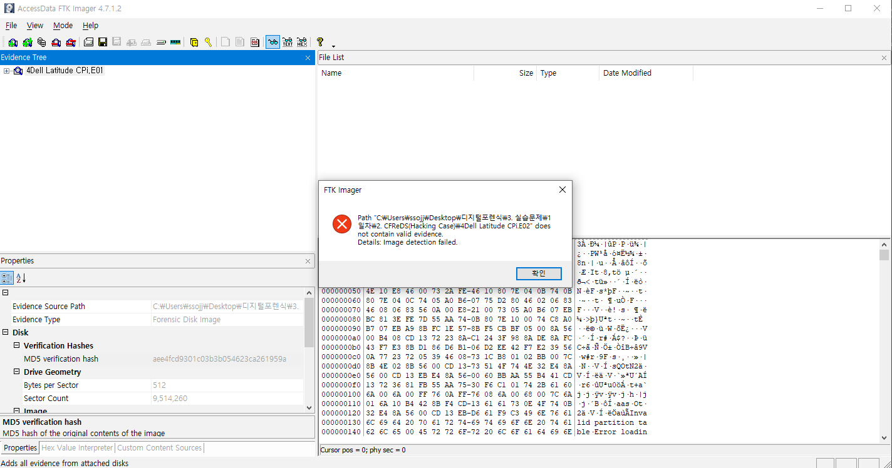

# 1. What is the image hash?

## 풀이 과정
### 1. FTK Imager 실행

- FTK Imager를 관리자 권한으로 실행한다.

### 2. 이미지 파일 불러오기

- File > Add Evidence Item... 을 클릭한다.
- Image file 을 클릭하고 경로를 넣어 이미지 파일을 불러온다.
- 불러온 파일은 4Dell Latitude CPi.E01 파일이다.

### 3. 해시값 확인

- Evidence Tree 창에서 이미지 파일을 선택한다.
- View > Properties 를 클릭한다.
- Properties 창에서 Verification Hashes > MD5 해시값을 확인한다.

### 추가

- 4Dell Latitude CPi.E02 파일을 불러오려고 하면 에러 메세지가 뜬다.
- 두 파일은 같은 파일을 여러 파트로 분할해 놓은 것이기 때문에 FTK Imager가 E01을 불러올 때 같은 폴더에 있는 E02 파일도 자동으로 연결해 불러온다.
- FTK Imager 등 포렌식 툴은 여러 파트로 분할된 파일들을 연결하여 하나의 전체 이미지로 읽는다.
- 포렌식 툴이 분할된 파일을 하나로 열기 위해서는 여러 파트의 파일들이 동일한 디렉토리에 있어야 하며 이름이 정확하게 일치해야 한다.