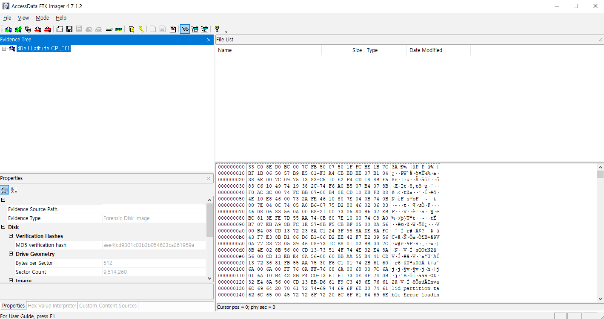
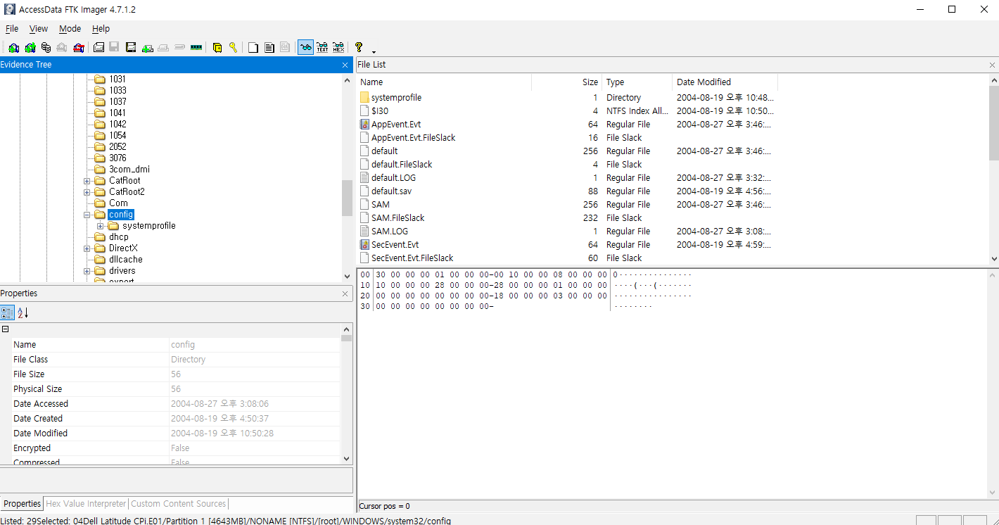
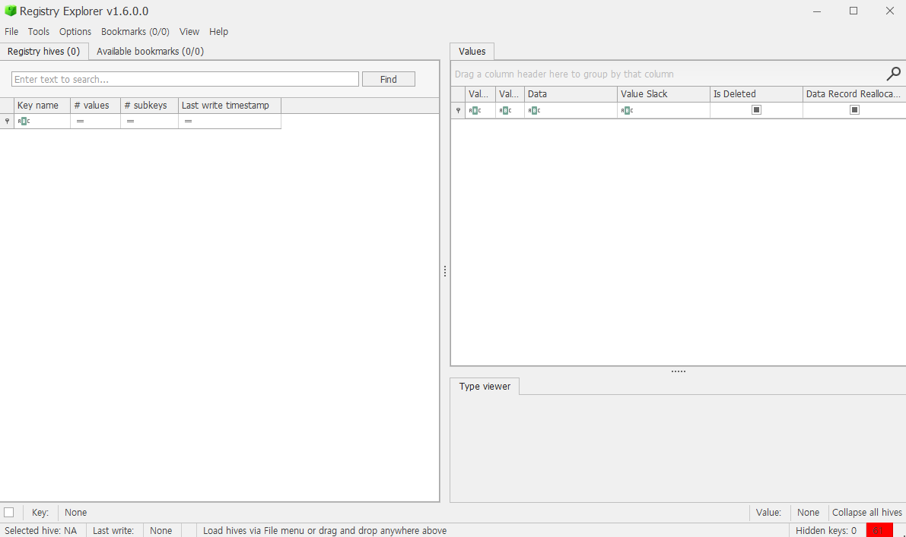
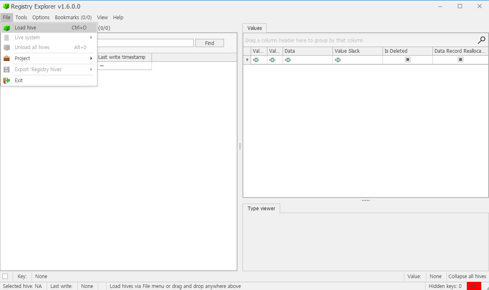

# 10. What is the account name of the user who mostly uses the computer?

## 풀이 과정
### 1. FTK Imager 실행, 이미지 파일 불러오기

### 2. 경로 찾아 들어가기

- Partiton 1 → Windows → System32 → config

### 3. SAM 파일 export

- SAM 파일은 컴퓨터의 사용자 계정 정보, 그룹 정보, 암호화된 비밀번호 등 보안과 관련된 핵심 정보를 담고 있는 레지스트리 하이브 파일이다.
- SAM 파일을 우클릭 후 내보내기 해준다.

### 4. Registry Explorer 열기

- Registry Explorer 설치 후 열어준다.

### 5. export 파일 불러오기

- File > Load Hive로 들어가 FTK Imager에서 export한 파일을 불러온다.
- 이 파일은 HKLM의 일부인 SAM 레지스트리 하이브 파일이다.

### 6. 마지막 사용 시간 확인

- SAM > Domains > Account > Users 경로에서 Last write timestamp를 확인한다.
- 가장 마지막에 사용한 사용자는 `000003EB`이다.

### 7. 마지막으로 사용한 유저 이름 찾기

- 마지막으로 사용한 사용자를 클릭하고 우측 탭에서 V를 누른다.
- 하단에 나오는 Hex Viewer에서 글자들을 살펴본다.
- `Mr.Evil` 글자를 확인할 수 있다.