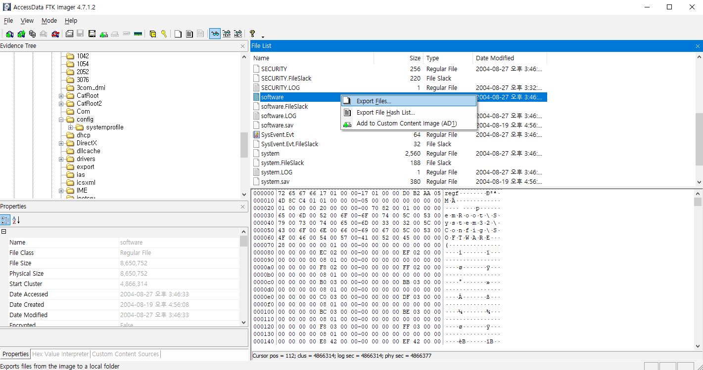
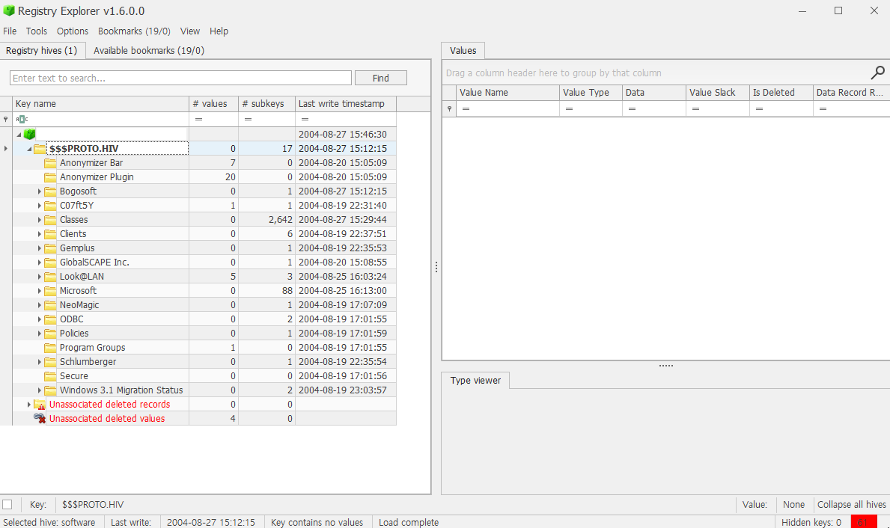
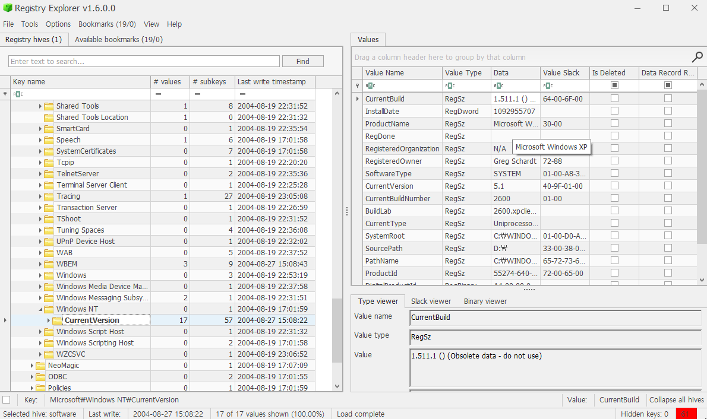
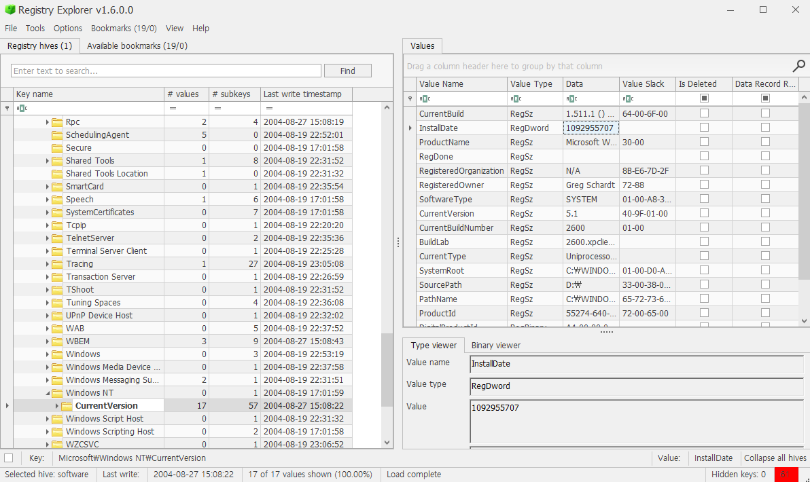
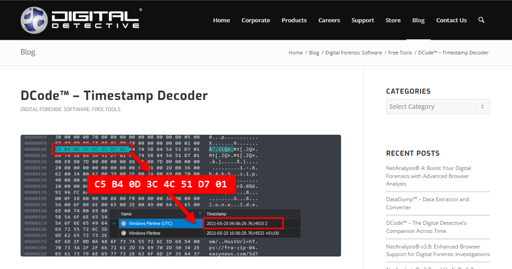
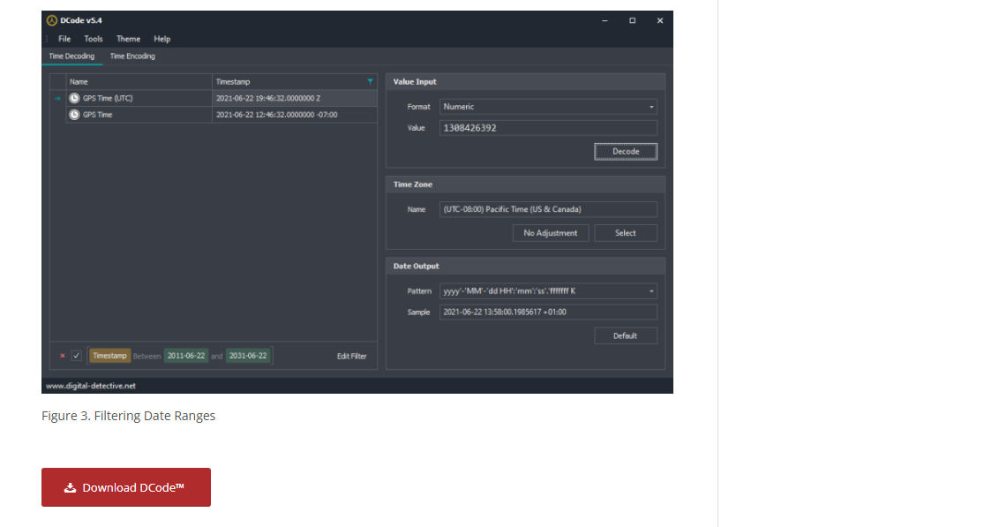
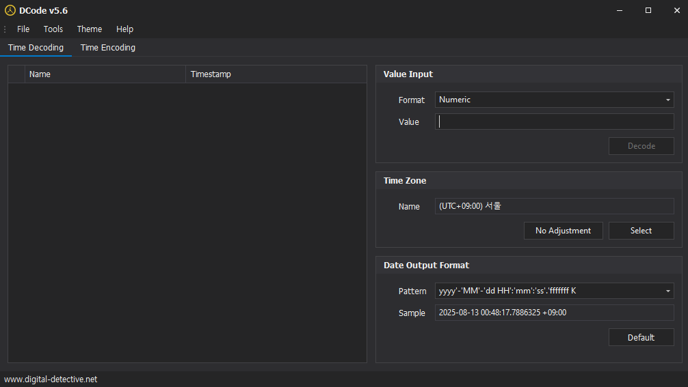
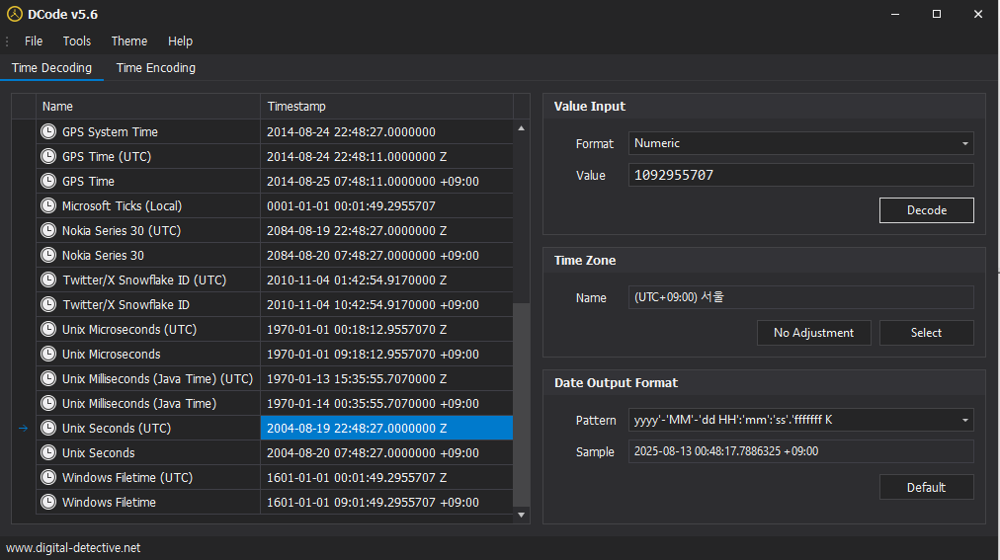

# 3. When was the install date?

## 풀이 과정
### 1. FTK Imager 실행, 이미지 파일 불러오기

### 2. 경로 찾아 들어가기

- Partiton 1 → Windows → System32 → config

### 3. software 파일 export

- HKLM(HKEY_LOCAL_MACHINE)은 레지스트리 전체를 아우르는 상위 개념이다.
- HKLM은 하나의 파일이 아니라, SOFTWARE, SYSTEM, SAM 등 여러 개의 개별 파일(레지스트리 하이브)이 합쳐져 만들어진 논리적 구조이다.
- HKLM이라는 개념 대신, 윈도우 버전 정보가 담겨 있는 실제 파일 software를 추출한다.
- software 파일은 윈도우에 설치된 모든 프로그램과 시스템 소프트웨어에 대한 정보, 그리고 윈도우 자체의 버전 정보를 담고 있다.
- software 파일을 우클릭 후 export 해준다.

### 4. Registry Explorer 열기

- Registry Explorer 설치 후 열어준다.

### 5. export 파일 불러오기

- File > Load Hive로 들어가 FTK Imager에서 export한 파일을 불러온다.
- 이 파일은 HKLM의 일부인 SOFTWARE 레지스트리 하이브 파일이다.

### 6. InstallDate 찾기

- Microsoft > Windows NT > CurrentVersion
- CurrentVersion 을 클릭하면 오른쪽 창에서 상세 정보를 볼 수 있다.
- 상세정보에서 InstallDate를 확인할 수 있다.
- 1092955707 라는 읽기 어려운 형식으로 되어있는 것을 확인할 수 있다.

### 7. InstallDate 변환
#### 1. DCode 설치

[DCode 주소](https://www.digital-detective.net/dcode/)

- 변환을 위해 DCode 를 다운로드 한다.

#### 2. DCode 실행

#### 3. InstallDate 변환

- Value Input > Value 필드에 FTK Imager에서 얻은 1092955707 값을 입력하고 Decode를 클릭한다.
- 윈도우 레지스트리의 InstallDate 값은 1970년 1월 1일 00:00:00 UTC를 기준으로 한 초 단위의 Unix 타임스탬프다.
- 왼쪽 목록에서 Unix Seconds를 확인해 InstallDate를 확인한다.
- UTC 시간: 2004-08-19 22:48:27