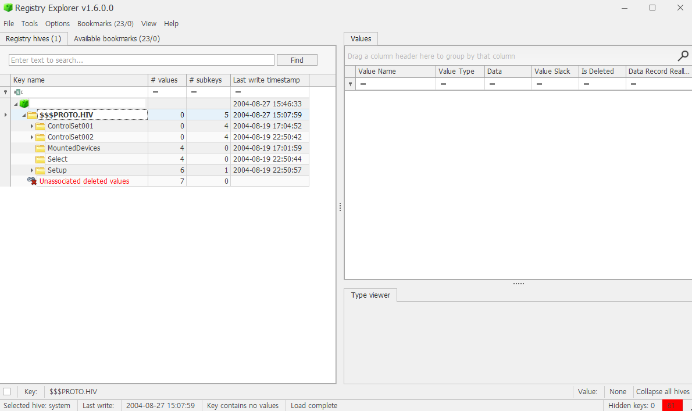

# 4. What is the timezone settings?

## 풀이 과정
### 1. FTK Imager 실행, 이미지 파일 불러오기

### 2. 경로 찾아 들어가기

- Partiton 1 → Windows → System32 → config

### 3. system 파일 export

- system 파일은 컴퓨터의 하드웨어 설정, 시스템 부팅 정보, 제어판 설정 등 운영체제의 핵심 구성 요소에 대한 정보를 담고 있는 레지스트리 하이브 파일이다.
- software파일은 설치된 프로그램과 윈도우 버전 정보를, system파일은 하드웨어와 관련된 설정을 담고 있다.

### 4. Registry Explorer 열기

- Registry Explorer 설치 후 열어준다.

### 5. export 파일 불러오기

- File > Load Hive로 들어가 FTK Imager에서 export한 파일을 불러온다.
- 이 파일은 HKLM의 일부인 SYSTEM 레지스트리 하이브 파일이다.

### 6. timezone setting 경로 찾기

- ControlSet001 > Control > TimeZoneInformation 경로를 찾아 들어간다.

### 7. timezone settings 확인

- StandardName은 Central Standard Time, DaylightName은 Central Daylight Time으로 설정되어 있다.
- Bias와 ActiveTimeBias 값에 60분 차이가 있다는 점에서 시스템은 일광 절약 시간제(Daylight Saving Time)를 적용 중이라는 것을 알 수 있다.
- Bias 값 360은 기본 시간대인 UTC-6을 의미한다. DaylightBias 값 -60분이 적용되어, 현재 사용되는 ActiveTimeBias 값은 300(UTC-5)이다.
- timezone settings은 Central Daylight Time (CDT), UTC -5 시간대를 사용 중이다.

## 결론

- 시간대 Timezone : Central Daylight Time (CDT)  
- 오프셋 : UTC -5  
- 상태 : 일광 절약 시간(DST) 적용 중