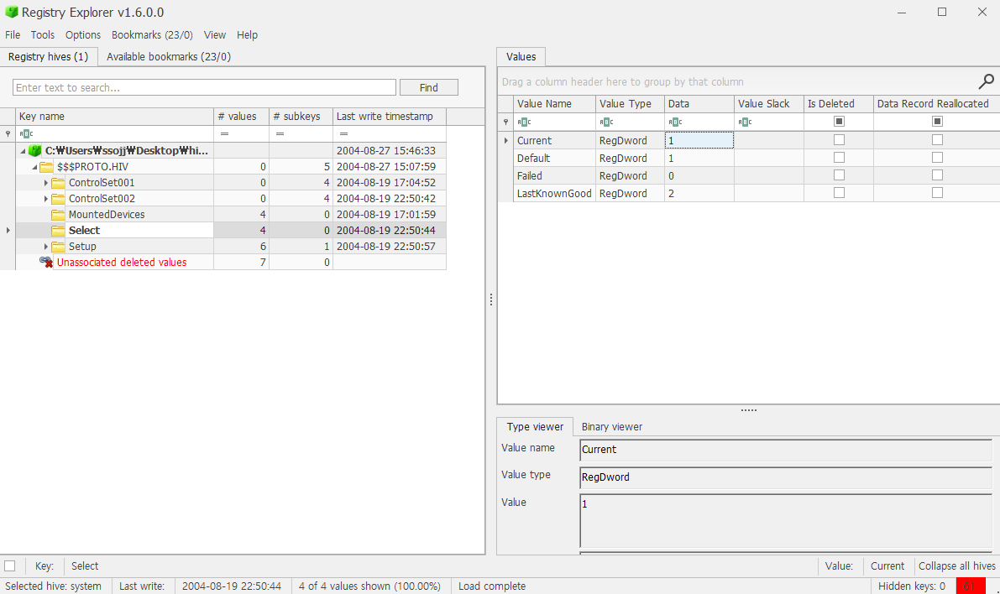
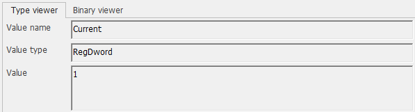
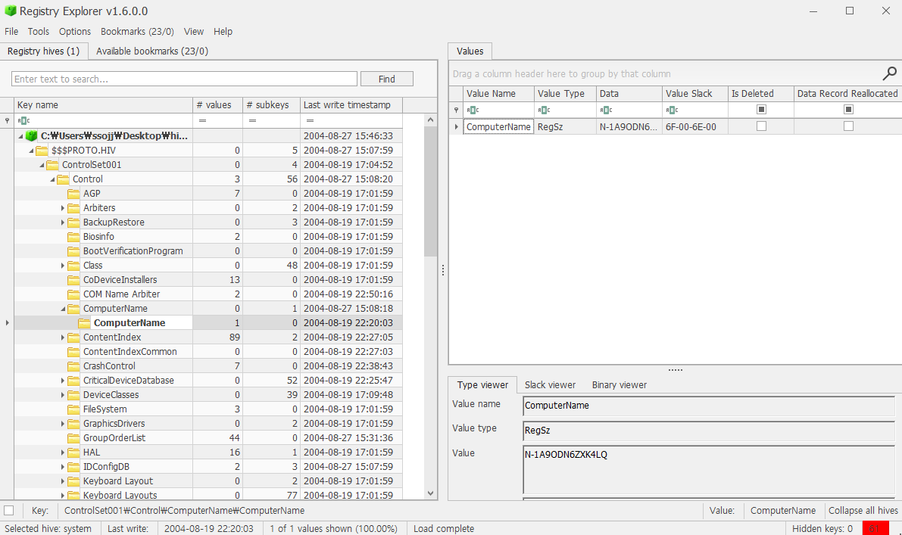
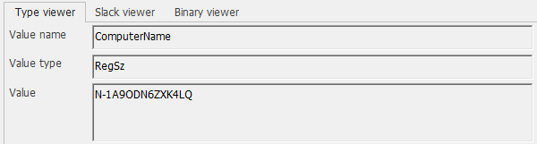

# 6. What is the computer account name?

## 풀이 과정
### 1. FTK Imager 실행, 이미지 파일 불러오기

### 2. 경로 찾아 들어가기

- Partiton 1 → Windows → System32 → config

### 3. system 파일 export

- system 파일은 컴퓨터의 하드웨어 설정, 시스템 부팅 정보, 제어판 설정 등 운영체제의 핵심 구성 요소에 대한 정보를 담고 있는 레지스트리 하이브 파일이다.
- software파일은 설치된 프로그램과 윈도우 버전 정보를, system파일은 하드웨어와 관련된 설정을 담고 있다.

### 4. Registry Explorer 열기

- Registry Explorer 설치 후 열어준다.

### 5. export 파일 불러오기

- File > Load Hive로 들어가 FTK Imager에서 export한 파일을 불러온다.
- 이 파일은 HKLM의 일부인 SYSTEM 레지스트리 하이브 파일이다.

### 6. Current 값 확인

- Select로 이동하고 Current 값을 확인한다.
- 컴퓨터가 사용하고 있는 ControlSet의 번호를 파악한다.
- 1번을 사용하고 있다는 것을 확인할 수 있다.

### 7. ComputerName 확인

- Current 값을 확인해 찾은 ControlSet001로 이동한다.
- ControlSet001 > Control > ComputerName > ComputerName 경로를 찾아 들어간다.
- ComputerName은 N-1A9ODN6ZXK4LQ로 확인된다.