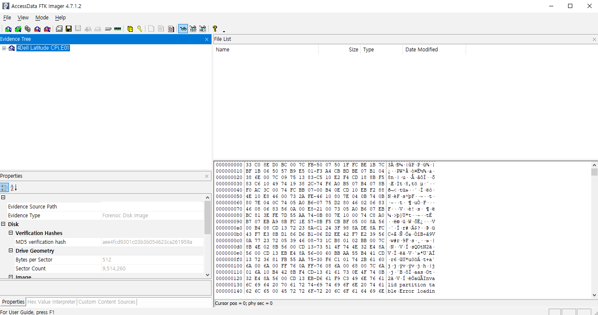
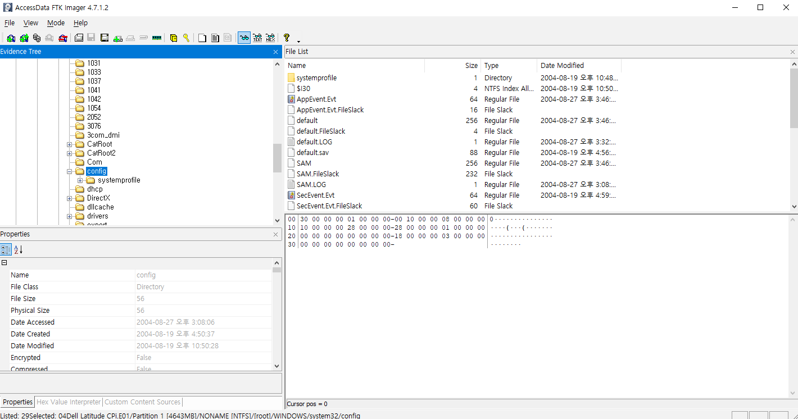
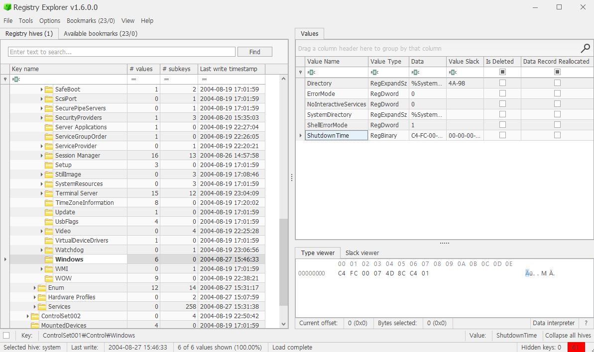
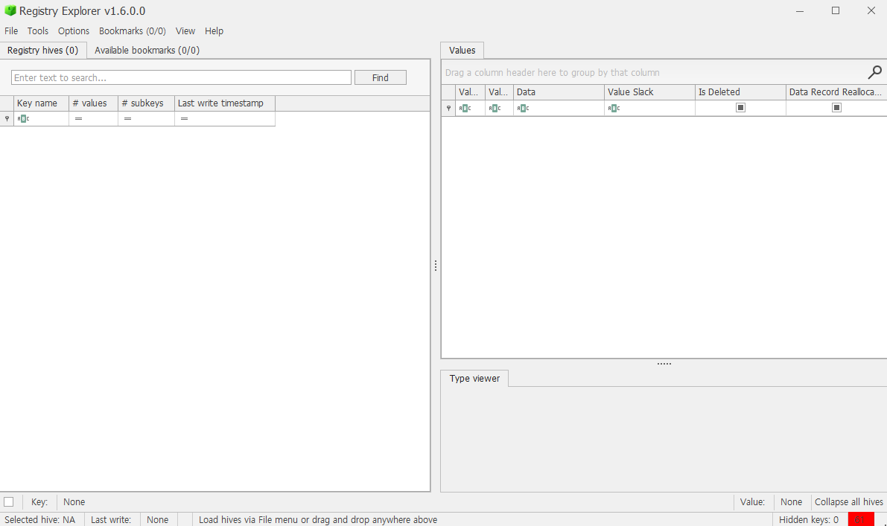
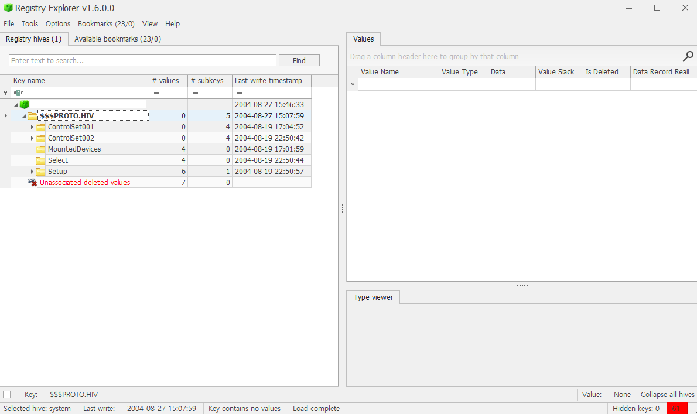
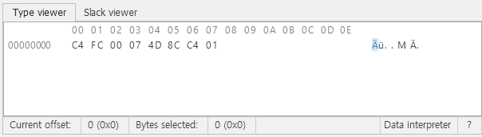
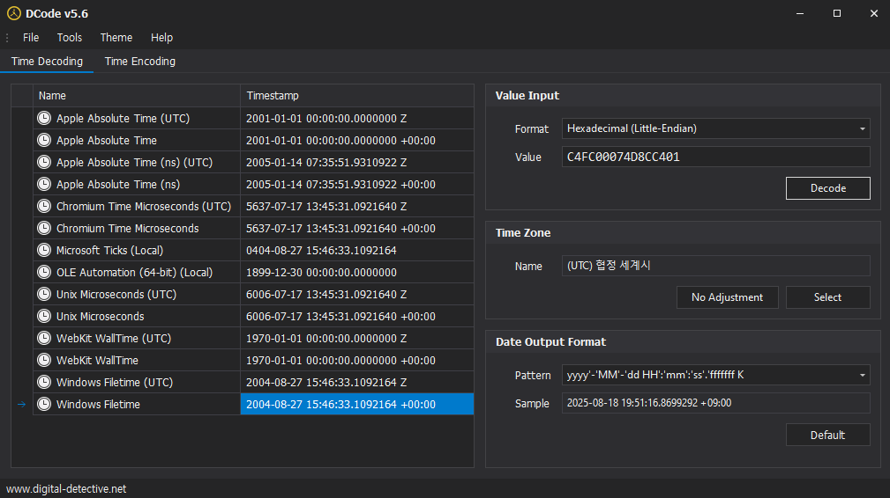

# 8. When was the last recorded computer shutdown date/time?

## 풀이 과정
### 1. FTK Imager 실행, 이미지 파일 불러오기

### 2. 경로 찾아 들어가기

- Partiton 1 → Windows → System32 → config

### 3. system 파일 export

- system 파일은 컴퓨터의 하드웨어 설정, 시스템 부팅 정보, 제어판 설정 등 운영체제의 핵심 구성 요소에 대한 정보를 담고 있는 레지스트리 하이브 파일이다.
- software파일은 설치된 프로그램과 윈도우 버전 정보를, system파일은 하드웨어와 관련된 설정을 담고 있다.

### 4. Registry Explorer 열기

- Registry Explorer 설치 후 열어준다.

### 5. export 파일 불러오기

- File > Load Hive로 들어가 FTK Imager에서 export한 파일을 불러온다.
- 이 파일은 HKLM의 일부인 SYSTEM 레지스트리 하이브 파일이다.

### 6. 경로 이동하기

- SYSTEM > ControlSet001 > Control > Windows 경로로 이동한다.
- Windows를 클릭해서 우측 창에 정보가 뜨도록 한다.

### 7. ShutdownTime 확인

- ShutdownTime을 클릭해 Data에 적힌 내용을 확인한다.
- C4 FC 00 07 4D 8C C4 01 를 확인할 수 있다. 이는 FILETIME으로,  1601년 1월 1일 UTC부터 100나노초 단위로 흘러간 시간을 나타내는 숫자로 되어있다.

### 8. 시간 변환

- 찾아낸 시간을 변환한다. DCode v5.6 프로그램을 사용하였다.
- Hexadecimal Little-Endian으로 변환하면 2004-08-27 15:46:33 시간을 확인할 수 있다.
- 레지스트리의 ShutdownTime은 항상 UTC(협정 세계시)로 기록된다.